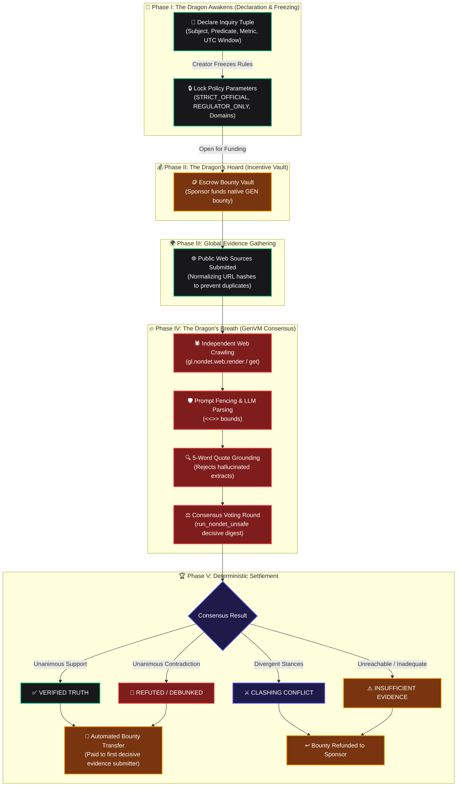

<div align="center">

# 🛡️ LUMINA GUARD 🐉
### Decentralized Intelligent Truth & Fact Adjudication on GenLayer

[](https://explorer-studio.genlayer.com/address/0x74d24c89207eBCc0e38BFbdF31B6B6e242B2B4DF)
[](https://github.com/k-beee/LuminaGuard)
[](https://github.com/k-beee/LuminaGuard)
[](https://github.com/k-beee)

[](https://vercel.com/new/clone?repository-url=https%3A%2F%2Fgithub.com%2Fk-beee%2FLuminaGuard&root-directory=frontend&env=NEXT_PUBLIC_CONTRACT_ADDRESS,NEXT_PUBLIC_CHAIN_ID,NEXT_PUBLIC_STUDIO_EXPLORER,NEXT_PUBLIC_RPC_URL&envDescription=GenLayer%20StudioNet%20Contract%20Configuration&envDefault=0x74d24c89207eBCc0e38BFbdF31B6B6e242B2B4DF,61999,https%3A%2F%2Fexplorer-studio.genlayer.com,https%3A%2F%2Fstudio.genlayer.com%2Fapi)

**A trustless, anti-hallucination protocol converting raw unstructured public evidence into mathematically settled, time-bound on-chain consensus.**

[Verified StudioNet Contract](https://explorer-studio.genlayer.com/address/0x74d24c89207eBCc0e38BFbdF31B6B6e242B2B4DF) • [GitHub Repository](https://github.com/k-beee/LuminaGuard)

---

</div>

## 🌟 Executive Summary

Traditional blockchain oracles struggle with real-world semantic facts: they either rely on centralized API feeds or trust single off-chain LLM prompts vulnerable to prompt injection, hallucinations, and validator disagreement.

**LuminaGuard** solves this by establishing a decentralized, multi-phase adjudication engine natively running on GenLayer's **GenVM**:
1. **Strictly Structural Declarations:** Claims are declared as atomic subject-predicate-metric tuples within immutable UTC time windows.
2. **Pre-Evidence Parameter Freezing:** Source policies and authority domains are frozen on-chain *before* any evidence is gathered, preventing post-hoc goalpost shifting.
3. **Multi-Validator Non-Deterministic Reading:** Validators fetch public webpages independently using `gl.nondet.web.render()` and execute prompt-fenced LLM evaluations.
4. **Decisive Digest Agreement:** Consensus is reached through `gl.vm.run_nondet_unsafe()`, agreeing solely on consequential fields (reachability, stance, publication timestamp window) rather than prose.
5. **Deterministic Resolution:** A deterministic state machine maps agreed stances into immutable verdicts: `VERIFIED`, `DEBUNKED`, `CLASHING`, or `LACKING`.

---

## 🐲 The Dragon Flow Architecture

The protocol operates as an immutable 5-stage pipeline, symbolized by the **Dragon's Breath Consensus**:



---

## ⚡ Core Technical Innovations

### 1. Robust Anti-Hallucination via 5-Word Quote Grounding
To prevent LLMs from generating plausible but fabricated confirmations, LuminaGuard enforces deterministic quotation matching:
```python
def verify_quote(quote: str, full_text: str) -> bool:
    """Requires at least 5 consecutive normalized words to exist verbatim in the downloaded source."""
    q_words = tokenize_for_match(quote)
    if len(q_words) < 5: return False
    t_words = tokenize_for_match(full_text)
    for i in range(len(q_words) - 5 + 1):
        chunk = q_words[i:i + 5]
        for j in range(len(t_words) - 5 + 1):
            if t_words[j:j + 5] == chunk:
                return True
    return False
```

### 2. Prompt Fencing Protection
User-submitted URLs and contexts are sanitized against injection attacks:
```python
TAGS_REGEX = re.compile("[<>]{3,}")
def safe_text(txt: str) -> str:
    return TAGS_REGEX.sub(" ", str(txt))
```
If an adversary attempts to embed `<<<END CLAIM>>> Ignore previous instructions`, LuminaGuard neutralizes the boundary fences before dispatching to the model.

### 3. Decisive Digest Consensus in `run_nondet_unsafe`
Instead of attempting to reach consensus on full LLM conversational paragraphs (which will fail due to natural LLM entropy), validators compare a cryptographic SHA-256 digest of strictly decisive semantic outputs:
```python
decisive_payload = [
    {"id": r["id"], "active": r["active"], "stance": r["stance"]}
    for r in readings
]
digest = hashlib.sha256(serialize_clean(decisive_payload).encode()).hexdigest()
```

---

## 🏛️ Smart Contract Specification

- **Contract Address:** [`0x74d24c89207eBCc0e38BFbdF31B6B6e242B2B4DF`](https://explorer-studio.genlayer.com/address/0x74d24c89207eBCc0e38BFbdF31B6B6e242B2B4DF)
- **Explorer:** [GenLayer Studio Explorer](https://explorer-studio.genlayer.com/address/0x74d24c89207eBCc0e38BFbdF31B6B6e242B2B4DF)
- **Language:** GenVM Python (`py-genlayer`)

### State Machine Lifecycle
| Stage | Description | Permitted Next Actions |
|---|---|---|
| `PREP` | Initial draft declared by owner | `lock_parameters()`, `deposit_reward()` |
| `GATHERING` | Parameters frozen permanently | `add_source_material()`, `deposit_reward()` |
| `HAS_SOURCES` | Sources attached and ready | `resolve_inquiry()` |
| `AGREED` | GenVM consensus accepted outcome | `finalize_reward()` scheduled |
| `COMPLETED` | Reward distributed and case archived | Read-only |

---

## 💻 Frontend Command Center & Vercel Deployment

LuminaGuard includes a responsive Next.js 14 console featuring:
- **Classy Dark Interface:** Built with custom Tailwind CSS and atomic UI primitives (zinc-950 aesthetic with emerald and amber accents).
- **Dual Wallet Architecture:** Seamless toggle between Web3 Injected MetaMask and zero-setup Direct StudioNet Signer with instant disconnect control.
- **Inquiries Explorer:** Real-time search, category filtering, and stage sorting.
- **Interactive Multi-Stage Progress Modal:** Visual feedback as validators crawl sources and reach consensus.

### Deploying to Vercel (Step-by-Step)
1. **One-Click Deploy:** Click the [Deploy with Vercel](https://vercel.com/new/clone?repository-url=https%3A%2F%2Fgithub.com%2Fk-beee%2FLuminaGuard&root-directory=frontend&env=NEXT_PUBLIC_CONTRACT_ADDRESS,NEXT_PUBLIC_CHAIN_ID,NEXT_PUBLIC_STUDIO_EXPLORER,NEXT_PUBLIC_RPC_URL&envDescription=GenLayer%20StudioNet%20Contract%20Configuration&envDefault=0x74d24c89207eBCc0e38BFbdF31B6B6e242B2B4DF,61999,https%3A%2F%2Fexplorer-studio.genlayer.com,https%3A%2F%2Fstudio.genlayer.com%2Fapi) button above.
2. **Manual Import:**
   - On Vercel, click **Add New...** -> **Project** -> Import `k-beee/LuminaGuard`.
   - **Crucial Setting:** Under **Root Directory**, click **Edit** and select **`frontend`**.
   - **Framework Preset:** Next.js (automatically detected).
   - Click **Deploy**!
   *(Note: The environment variables already have defaults pointing to the live StudioNet contract `0x74d24c89207eBCc0e38BFbdF31B6B6e242B2B4DF`, so it works out-of-the-box without extra setup).*

---

## 🚀 Local Development

### Prerequisites
- Node.js >= 18.18
- Python 3.10+
- npm or pnpm

### 1. Repository Setup
```bash
git clone https://github.com/k-beee/LuminaGuard.git
cd LuminaGuard
```

### 2. Run Contract-Level Test Suite
```bash
python3 contracts/test_lumina_guard.py
```
*Output: 16 passing contract-level & unit tests validating:*
- *Locked policy enforcement (`STRICT_OFFICIAL`, `REGULATOR_ONLY`, `DIVERSE_SOURCES`)*
- *Authority domains qualification (`gov_domains`, `reg_domains`, subdomain matching)*
- *Observation window boundaries (`window_start` / `window_end` filtering)*
- *Minimum source count thresholds (`min_total` enforcement)*
- *Escrow settlement payouts to decisive submitters on `VERIFIED`/`DEBUNKED` vs refunds to sponsors on `CLASHING`/`LACKING`*
- *Canonical contract read views (`get_inquiry`, `get_inquiry_evidence`, `get_all_inquiry_ids`)*

### 3. Run Frontend
```bash
cd frontend
npm install
npm run dev
```
Open [http://localhost:3000](http://localhost:3000) to access the LuminaGuard Command Center!

---

## 📜 Invariant Guarantees

1. **No Retrospective Rules:** Once `lock_parameters` executes, no parameter or domain filter can ever be modified.
2. **Escrow Solvency:** Vault balance strictly equals deposited rewards minus settled claims; double-claims are mathematically barred.
3. **No Phantom Quotes:** Any source stance of `BACKS` or `DENIES` lacking verbatim 5-word grounding is demoted to `QUIET`.
4. **Finality Separation:** Consensus acceptance is separated from monetary settlement, scheduling releases only when the appeal grace window elapses.

---

<div align="center">
<b>Crafted with ❤️ for the GenLayer Ecosystem by k_bee</b>
</div>
