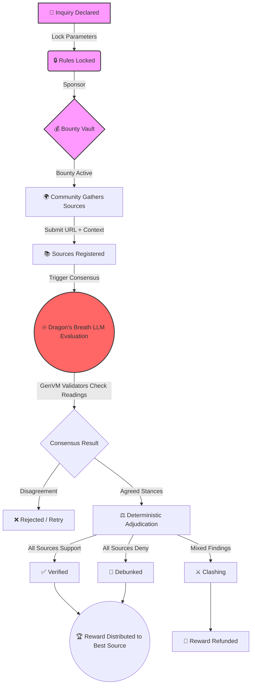

# LuminaGuard 🛡️🐉

LuminaGuard is a highly-resilient, decentralized, unbiased Fact Adjudication engine built on GenLayer. 
It enables the seamless validation of claims by utilizing community-submitted sources, rigorous LLM evaluation, and transparent deterministic processing.

## How it works (The Dragon Flow)

## Setup & Deployment

1. **Smart Contract:** The contract is located in `contracts/lumina_guard.py`. It is a fully GenVM compatible smart contract ready for StudioNet.
2. **Frontend:** The frontend is a Next.js application that provides a sleek, dark-mode, highly professional interface to manage inquiries, submit sources, and view verdicts.

## Architecture

- **GenVM Python Contract**: Core logic to safely register claims, lock parameters, receive evidence, and run a safe consensus using `gl.vm.run_nondet_unsafe`.
- **Next.js Frontend**: A modern React application with shadcn/ui components for a premium user experience.

---
**Built by k_bee**
